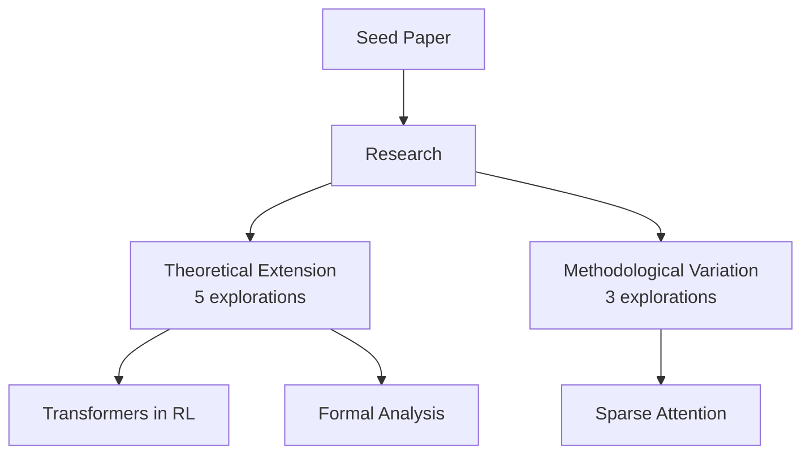

# Advanced Tools Guide

## 🛠️ 高级工具套件

本项目现在包含 5 个强大的工具来增强学术研究探索能力。

---

## 📚 工具总览

| 工具 | 功能 | 输入 | 输出 |
|------|------|------|------|
| **arXiv Search** | 文献检索 | 关键词/主题 | 相关论文列表(JSON/MD) |
| **Novelty Scorer** | 原创性评分 | 研究提案 | 创新性得分报告 |
| **LaTeX Converter** | 格式转换 | Markdown | LaTeX文档 |
| **Research Visualizer** | 演化可视化 | 研究目录 | 可视化报告 |
| **Collaborative Mode** | 代理协作 | 种子论文 | 经同行评审的提案 |

---

## 1️⃣ arXiv 文献检索

### 功能
从 arXiv 实时搜索相关论文，获取最新研究动态。

### 使用方法

```bash
# 基础搜索
python tools/arxiv_search.py "attention mechanism" 10

# 输出示例
{
  "title": "Attention Is All You Need",
  "authors": ["Vaswani", "Shazeer", ...],
  "abstract": "The dominant sequence transduction...",
  "arxiv_id": "1706.03762",
  "pdf_url": "https://arxiv.org/pdf/1706.03762.pdf",
  "published": "2017-06-12",
  "categories": ["cs.CL", "cs.LG"]
}
```

### 集成到研究流程

```python
# 在生成研究探索前，先搜索相关文献
python tools/arxiv_search.py "transformer efficiency" 15 > literature.json

# 然后在研究探索中引用这些论文
```

### Python API 使用

```python
from tools.arxiv_search import ArxivSearcher

searcher = ArxivSearcher(max_results=10)
papers = searcher.search("graph neural networks", categories=['cs.LG', 'cs.AI'])

# 格式化为 Markdown
markdown = searcher.format_as_markdown(papers)
print(markdown)
```

---

## 2️⃣ 原创性评分器

### 功能
自动评估研究提案的创新性和独特性。

### 使用方法

```bash
# 评分单个提案
python tools/novelty_scorer.py research_output/research_1.md

# 与现有提案对比
python tools/novelty_scorer.py research_output/research_10.md research_output/
```

### 输出示例

```json
{
  "overall_score": 72.5,
  "conceptual_novelty": 80.0,
  "methodological_novelty": 65.0,
  "uniqueness_score": 72.5,
  "key_innovations": [
    "novel sparse attention",
    "first to combine transformers with graphs",
    "unprecedented efficiency"
  ],
  "similarity_warnings": [
    "High similarity (45%) with existing proposal #3"
  ],
  "recommendation": "✓ MODERATELY NOVEL - Good research direction with room for enhancement"
}
```

### 批量评分

```bash
# 评分整个目录
for file in research_output/*.md; do
    python tools/novelty_scorer.py "$file" research_output/ >> novelty_report.json
done
```

### Python API

```python
from tools.novelty_scorer import NoveltyScorer

scorer = NoveltyScorer()

with open('research_1.md', 'r') as f:
    proposal = f.read()

# 获取现有提案
existing = []
# ... 加载现有提案 ...

results = scorer.score_proposal(proposal, existing)
print(f"Novelty Score: {results['overall_score']}/100")
print(f"Recommendation: {results['recommendation']}")

# 生成报告
report = scorer.format_report(results)
with open('novelty_report.md', 'w') as f:
    f.write(report)
```

---

## 3️⃣ LaTeX 转换器

### 功能
将 Markdown 研究提案转换为可发表的 LaTeX 文档。

### 使用方法

```bash
# 转换单个文件
python tools/latex_converter.py research_output/research_1.md

# 指定输出文件名
python tools/latex_converter.py research_output/research_1.md paper.tex

# 编译 PDF
pdflatex paper.tex
```

### 批量转换

```bash
# 转换所有研究提案
for md in research_output/*.md; do
    python tools/latex_converter.py "$md"
done

# 现在每个 .md 都有对应的 .tex 文件
```

### 自定义元数据

```python
from tools.latex_converter import LatexConverter

converter = LatexConverter()

with open('research_1.md', 'r') as f:
    markdown = f.read()

metadata = {
    'author': 'Dr. Jane Smith',
    'date': '2025-01-15'
}

latex = converter.convert(markdown, metadata)

with open('paper.tex', 'w') as f:
    f.write(latex)
```

### 输出 LaTeX 特性

生成的 LaTeX 文档包含：
- 标准学术论文格式（11pt，A4纸）
- 超链接支持
- 数学公式环境
- 引用和参考文献支持
- 自动格式化的章节和列表

---

## 4️⃣ 研究演化可视化

### 功能
分析和可视化研究探索的演化轨迹和维度分布。

### 使用方法

```bash
# 生成可视化报告
python tools/research_visualizer.py research_output/

# 指定输出文件
python tools/research_visualizer.py research_output/ evolution_report.md
```

### 输出示例

```markdown
# Research Evolution Analysis Report

**Total Research Explorations:** 15

## Research Dimension Distribution

Theoretical Extension      | ████████████ 5
Methodological Variation   | ████████ 3
Application Transfer       | ████████████████ 7
Limitation Addressing      | ████ 2
Critical Analysis          | ████ 1
Cross-Disciplinary         | ████████ 3

## Evolution Trajectory
1. Theoretical Extension
2. Application Transfer
3. Methodological Variation
...

## Visual Exploration Map
[Mermaid 流程图显示研究演化]
```

### Mermaid 图表

生成的 Mermaid 图表可以在 GitHub、Markdown 编辑器中直接查看：



### Python API

```python
from tools.research_visualizer import ResearchVisualizer

visualizer = ResearchVisualizer()

# 分析目录
analysis = visualizer.analyze_directory('research_output/')

print(f"Total: {analysis['total_count']}")
print(f"Dimensions: {analysis['dimension_distribution']}")

# 生成 ASCII 图表
chart = visualizer.generate_ascii_chart(analysis)
print(chart)

# 生成 Mermaid 图
mermaid = visualizer.generate_mermaid_diagram(analysis)
print(mermaid)
```

---

## 5️⃣ 代理协作模式

### 功能
让多个 AI 代理相互评审、优化和综合研究提案。

### 使用方法

#### 模式 1: Critique（同行评审）

```bash
# 在 Claude Code 中运行
/research_collaborative seed_papers/transformer.md collab_critique 5 critique
```

**产生：**
- `collab_critique/round1/` - 5 个初始提案
- `collab_critique/critiques/` - 每个提案的评审意见
- `collab_critique/summary_report.md` - 综合分析

#### 模式 2: Refine（迭代优化）

```bash
/research_collaborative seed_papers/transformer.md collab_refine 3 refine
```

**产生：**
- `round1/` - 初始提案
- `critiques/` - 评审意见
- `round2/` - 优化后的 v2 版本
- `round3/` - 进一步优化的 v3 版本
- `improvement_report.md` - 改进追踪

#### 模式 3: Synthesize（综合创新）

```bash
/research_collaborative seed_papers/transformer.md collab_synth 6 synthesize
```

**产生：**
- `initial/` - 6 个原始提案
- `synthesized/` - 2-3 个综合提案（组合相关想法）
- `synthesis_map.md` - 综合策略说明

### 协作模式优势

| 特性 | Critique | Refine | Synthesize |
|------|----------|--------|-----------|
| **质量提升** | ✅✅✅ 最高 | ✅✅ 高 | ✅✅ 高 |
| **创新融合** | ✅ 中 | ✅ 中 | ✅✅✅ 最高 |
| **时间成本** | 中 | 高（多轮） | 中 |
| **适用场景** | 质量筛选 | 深度打磨 | 交叉创新 |

---

## 🔄 完整工作流程示例

### 端到端学术研究流水线

```bash
# ========== 阶段 1: 文献调研 ==========
# 搜索相关论文
python tools/arxiv_search.py "transformer attention efficiency" 20 > literature.json

# 创建种子论文摘要（手工或基于 literature.json）
# ... 编辑 seed_papers/my_research_area.md ...

# ========== 阶段 2: 生成研究方向 ==========
# 启动 Claude Code
claude

# 生成 10 个初始方向（在 Claude Code 中）
/research_deep_dive seed_papers/my_research_area.md phase1_initial 10

# ========== 阶段 3: 原创性评分 ==========
# 评估每个提案的创新性
cd phase1_initial
for md in *.md; do
    python ../tools/novelty_scorer.py "$md" . >> ../novelty_scores.json
done

# 选出得分 > 70 的提案（假设是 research_3, research_7, research_9）

# ========== 阶段 4: 协作优化 ==========
# 对选中的提案进行同行评审和优化（在 Claude Code 中）
/research_collaborative phase1_initial/research_3.md phase2_refined_3 1 refine
/research_collaborative phase1_initial/research_7.md phase2_refined_7 1 refine
/research_collaborative phase1_initial/research_9.md phase2_refined_9 1 refine

# ========== 阶段 5: LaTeX 转换 ==========
# 将最终版本转换为 LaTeX
python tools/latex_converter.py phase2_refined_3/round3/research_3_v3.md final_paper_3.tex
python tools/latex_converter.py phase2_refined_7/round3/research_7_v3.md final_paper_7.tex
python tools/latex_converter.py phase2_refined_9/round3/research_9_v3.md final_paper_9.tex

# 编译 PDF
pdflatex final_paper_3.tex

# ========== 阶段 6: 可视化分析 ==========
# 生成演化报告
python tools/research_visualizer.py phase1_initial/ evolution_report.md

# ========== 结果 ==========
# ✅ 20 篇相关文献（literature.json）
# ✅ 10 个初始研究方向
# ✅ 3 个高质量优化提案（经过 3 轮改进）
# ✅ 3 篇可发表的 LaTeX 论文草稿
# ✅ 1 份完整的研究���化分析报告
```

---

## 🎯 最佳实践

### 1. 文献检索策略
- 在生成研究方向**之前**先搜索文献
- 使用多个关键词组合（如 "attention + efficiency"）
- 关注最近 2-3 年的论文

### 2. 原创性评分使用
- **阈值设置**：
  - ≥80: 高度创新，优先发展
  - 60-79: 中等创新，可进一步优化
  - <60: 需要重大修改
- 定期评分，追踪改进

### 3. LaTeX 转换时机
- 在提案经过至少 1 轮优化后
- 准备投稿前转换
- 需要正式展示时

### 4. 可视化分析用途
- 检查研究维度平衡性
- 识别研究集群和趋势
- 向导师/团队展示研究规划

### 5. 协作模式选择
- **初期探索**: 使用 critique 筛选
- **深度打磨**: 使用 refine 优化
- **创新融合**: 使用 synthesize 组合

---

## 📊 性能与限制

| 工具 | 速度 | 网络需求 | 依赖 |
|------|------|---------|------|
| arXiv Search | 快（2-5秒） | ✅ 需要 | Python 3 |
| Novelty Scorer | 快（<1秒） | ❌ 不需要 | Python 3 |
| LaTeX Converter | 极快（<1秒） | ❌ 不需要 | Python 3 |
| Visualizer | 快（1-3秒） | ❌ 不需要 | Python 3 |
| Collaborative | 慢（10-30分钟） | ❌ 不需要 | Claude Code |

---

## 🐛 故障排查

### arXiv Search 失败
```bash
# 检查网络连接
curl http://export.arxiv.org/api/query

# 如果超时，增加 timeout 或使用代理
```

### Novelty Scorer 得分异常低
- 检查提案是否包含创新性关键词（novel, new, first 等）
- 确保与现有提案有足够差异

### LaTeX 编译错误
```bash
# 检查特殊字符是否正确转义
# 手动编辑 .tex 文件修复

# 使用 pdflatex -interaction=nonstopmode 忽略小错误
pdflatex -interaction=nonstopmode paper.tex
```

### Visualizer 无法识别维度
- 确保研究文件名格式为 `research_N.md`
- 检查内容是否包含维度相关关键词

---

## 🚀 未来增强

计划中的功能：
- [ ] Semantic Scholar API 集成
- [ ] 自动引用生成
- [ ] 交互式可视化（Web界面）
- [ ] GPT-4 辅助的更精确原创性评分
- [ ] 自动化端到端流水线脚本

---

## 📚 相关文档

- [QUICKSTART.md](QUICKSTART.md) - 基础使用
- [RESEARCH_USAGE_GUIDE.md](RESEARCH_USAGE_GUIDE.md) - 深入指南
- [ARCHITECTURE.md](ARCHITECTURE.md) - 系统架构

---

**现在你拥有完整的学术研究自动化工具链！🎓**
